从网易博客搬运过来，原链接：http://blog.163.com/yucan_unique/blog/static/1738993692015112795210668/

## 下载
1. [JDK](http://download.oracle.com/otn-pub/java/jdk/8u66-b18/jdk-8u66-windows-x64.exe): http://www.oracle.com/technetwork/java/javase/downloads/jdk8-downloads-2133151.html

	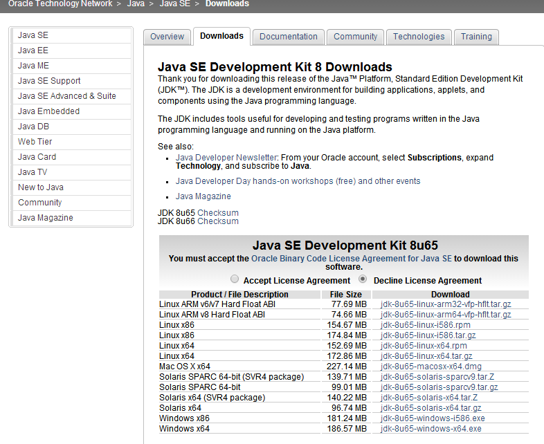

2. [Eclipse IDE for Java EE Developers](http://mirrors.ustc.edu.cn/eclipse/technology/epp/downloads/release/mars/1/eclipse-jee-mars-1-win32-x86_64.zip)：http://www.eclipse.org/downloads/

	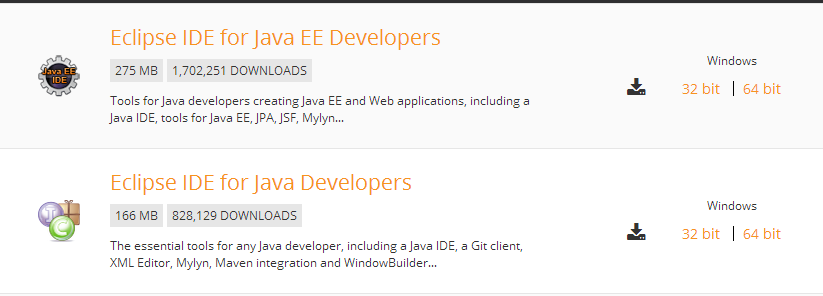

3. [Android SDK](https://dl.google.com/android/android-sdk_r24.3.4-windows.zip)：https://developer.android.com/studio/index.html

	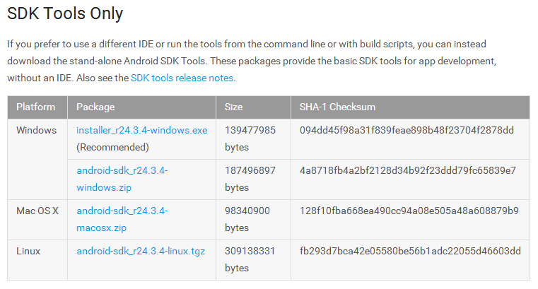

4. [ADT](https://dl.google.com/android/ADT-23.0.7.zip)：可用eclipse在线装，也可以预先下载离线包

	这里查看ADT版本日志 https://developer.android.com/studio/tools/sdk/eclipse-adt.html

	如果资源下载受阻，可参考以下链接：
	- [无需翻墙， Android官方开发相关下载资源一揽子大汇总](http://www.apkbus.com/forum.php?mod=viewthread&tid=174440)
	- [AndroidDevTools](http://www.androiddevtools.cn/)

## JDK
1. 安装

	双击安装刚才下载的JDK文件，安装完后可以在`C:\Program Files\Java`下看到如下图：

	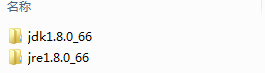

	检查是否安装成功，在命令行输入`java -version`执行，如下图：

	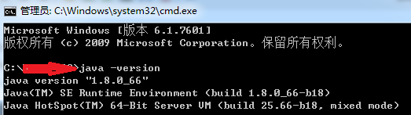

	如此显示，则安装成功。

2. 配置

	控制面板->所有控制面板项->系统->高级系统设置->环境变量

	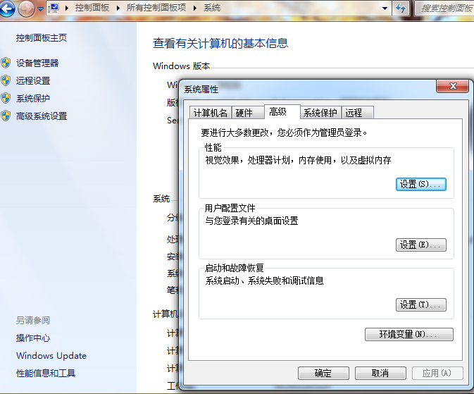

	1. 系统变量->新建

		变量名：`JAVA_HOME`

		变量值：`C:\Program Files\Java\jdk1.8.0_66`（对应安装的JDK目录的文件夹名）

		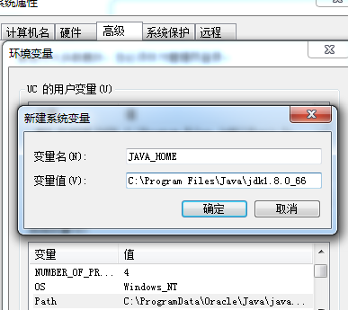

	2. 系统变量->新建

		变量名：`CLASSPATH`

		变量值：`.;%JAVA_HOME%\lib;%JAVA_HOME%\lib\tools.jar;%JAVA_HOME%\lib\dt.jar`（对应JDK目录下的lib文件夹，前面的英文句号（`.`）表示当前目录）

		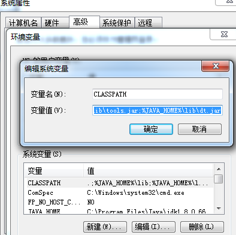

	3. 系统变量->选中Path->编辑

		你可以选择在原有变量值最前，添加 `%JAVA_HOME%\bin;%JAVA_HOME%\jre\bin;`

		也可以选择在原有变量值最后，添加 `;%JAVA_HOME%\bin;%JAVA_HOME%\jre\bin`

		注意英文分号（;）是用来区分Path里的不同路径的。

		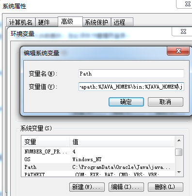

## Eclipse
1. 安装

	将下载好的压缩包解压到你想自己位置，我这里选`C:\Program Files\`。

2. 配置

	进入eclipse目录`C:\Program Files\Java\eclipse`，打开eclipse，设置工作区位置到你想要的位置，我这里选`E:\workspace`。

	

## Android SDK
1. 安装

	因为无论是下载的安装程序还是压缩包，都要配置环境变量，所以我就直接用压缩包了。

	将下载好的*android-sdk_r24.3.4-windows.zip*中的*android-sdk-windows*文件夹，解压到自己指定位置`C:\Program Files\Android`。

2. 配置

	按照第二步中的方法配置环境变量，修改系统变量中的Path，变量值最前面加入`C:\Program Files\Android\android-sdk-windows\tools;`，这就是Android SDK的tools目录。

	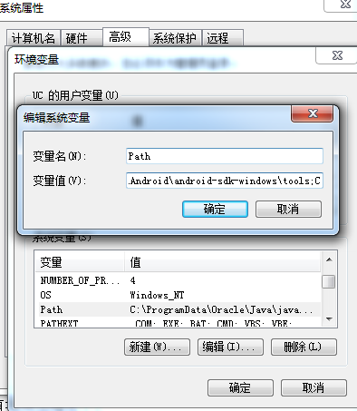

	然后，在命令行输入`android -h`执行，如果出现以下画面，说明Android SDK安装成功。

	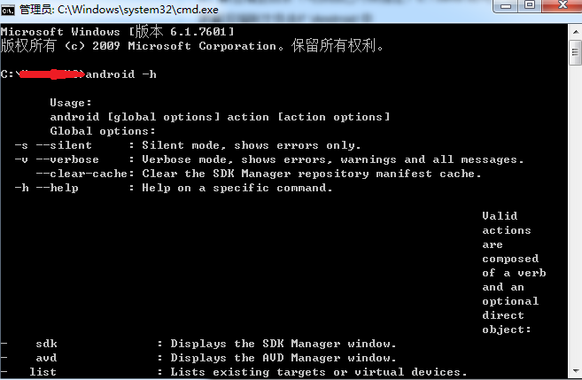

	还没完，因为可能会出现后面ADT在线安装检测不到安装包的问题，需要在这里先进行一些安装操作。

	打开Android SDK安装目录下的SDK Manager.exe，因为GFW的缘故，会出现获取失败的情况

	

	

	需要翻墙，不过可以通过修改hosts文件来解决

	找到`C:\Windows\System32\drivers\etc`路径下的`hosts`文件，用文本编辑器打开hosts，在最后面添加两行：

	```text
	203.208.46.146 dl.google.com
	203.208.46.146 dl-ssl.google.com
	```

	将本地访问dl.google.com和dl-ssl.google.com重定向到ip地址为203.208.46.146的服务器上。

	打开SDK Manager.exe，tools->Options...，勾选Force https://... sources to be fetched using http://... ，重启SDK Manager。

	如果还是不行，SDK Manager->Tools->Options，在Android SDK Manager - Settings的Proxy Settings两栏输入以下：

	HTTP Proxy Server：android-mirror.bugly.qq.com

	HTTP Proxy Port：8080

	勾选Force https://... sources to be fetched using http://...，如果前面已勾选则忽略，然后close返回主界面。

	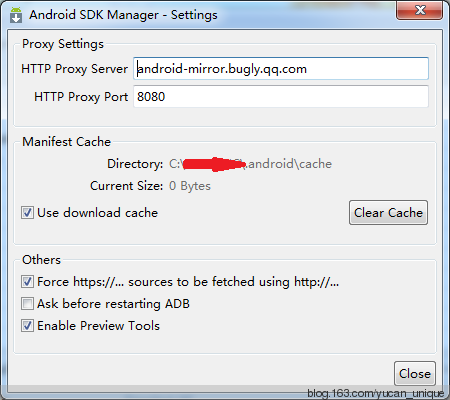

	接着Packages->Reload，就可以搜索到安装工具了

	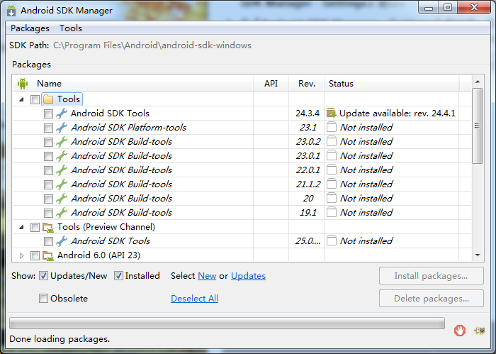

	选择开发所需的工具，或者在Android官网查看必须要安装的工具：http://developer.android.com/intl/zh-cn/sdk/installing/adding-packages.html

	为了应对不能打开这个网址的情况，还是把清单列出来吧：
	1. 获得最新的SDK工具:
		- Android SDK Tools
		- Android SDK Platform-tools
		- Android SDK Build-tools（最高版本）
	2. 打开第一个Android X.X 文件夹（最新版本）并选择：
		- SDK Platform
		- 模拟器系统映像，例如 ARM EABI v7a System Image
	3. 获得其他 API 的支持库
		- Android Support Repository
		- Android Support Library
		(Android Wear,Android TV,Google Cast,Navigation drawer,Swipe views,Backward-compatible action bar都需要这个库)
	4. 为更多使用Google API进行开发打开 Extras 目录并选择：
		- Google Repository
		- Google Play services
		(用户身份验证,Google 地图,Google Cast,游戏成就和排行榜等.要在 Android 模拟器中使用这些API，还必须安装SDK管理器中最新Android X.X目录内的Google APIs系统映像。)

	

	选择右下角Accept License->Install，就会开始安装工具，等待进度条走完就ok了。

## ADT for Eclipse
- 安装

	打开eclipse，菜单栏Help->Install New Software...->add...，所填如下：

	Name：Android ADT

	Location：http://dl-ssl.google.com/android/eclipse/

	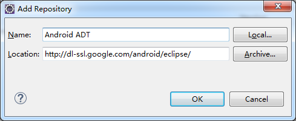

	点击OK。

	如果pending失败，可以将Location直接Achive...导入前面下载的ADT-23.0.7.zip，不需要解压。

	然后，就可以看到所有待安装的工具了。

	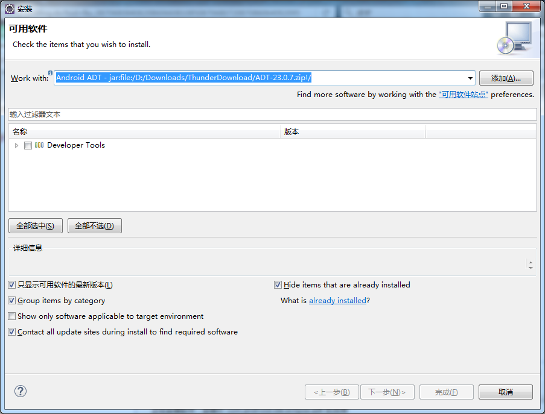

	全选，接着Next->选中I accept the...blabla->Finish，接着Yes重启eclipse，ADT安装完成

	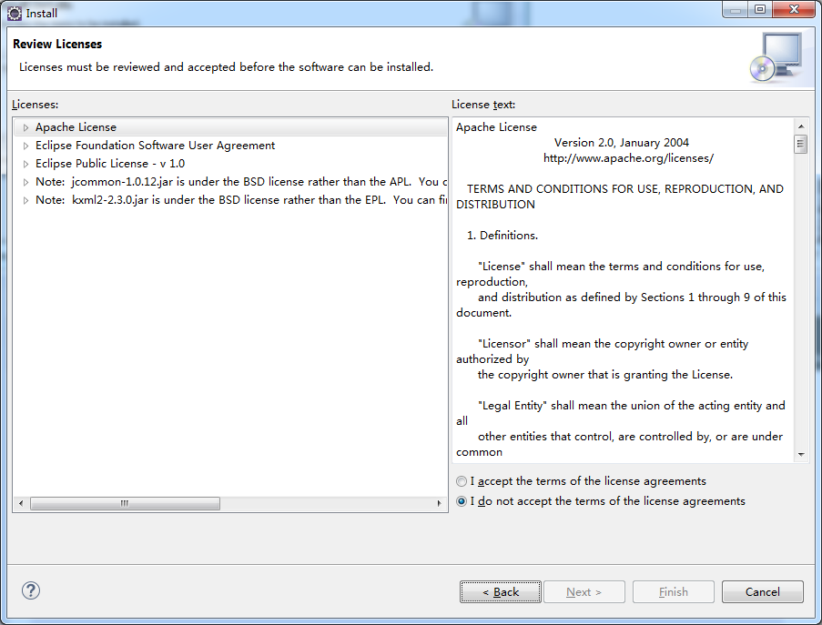

	如果有Warning直接OK

	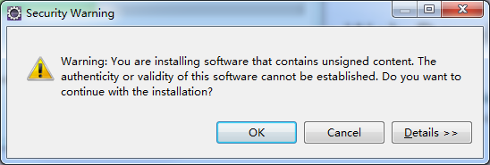

	如果有Location of the Android SDK提示，选Open Preferences

	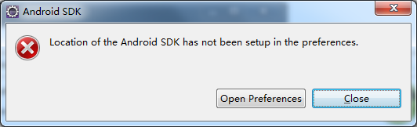

	选中Use existing SDKs->Browse...，选择之前解压Android SDK的位置`C:\Program Files\Android\android-sdk-windows`

	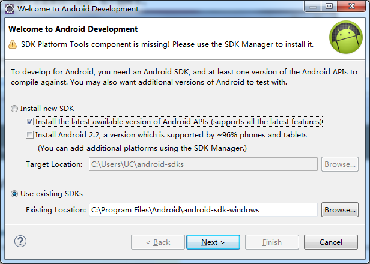

	如果没有自动提示上面弹窗，则打开eclipse的菜单栏Windows->Preferences，进入右边SDK  Location，选择之前解压Android SDK的位置`C:\Program Files\Android\android-sdk-windows`，OK完成，下面就可以看到已经安装的SDK工具了，如果还要安装其他的工具就找到SDK的安装目录启动SDK Manager.exe再进行在线安装

	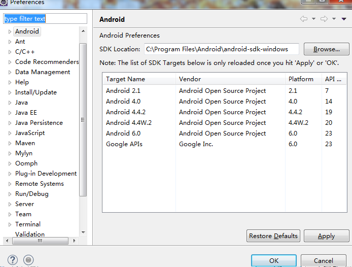

## 配置Android模拟器AVD
打开Eclipse，Windows->Android Virtual Device Manager

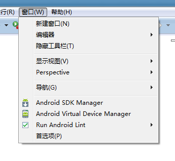

如果Eclipse的Windows选项下面没有Android Virtual Device Manager和SDK manager的选项，说明前面的第四、第五步有问题。第四步里SDK manager必要的工具一定要安装，因为网络可能不稳定的原因一定要耐心等待，全部安装完成，并且查看一下环境变量中的系统变量的Path是否添加了Eclipse和SDK manager的路径，记得英文分号隔开，第五步的ADT倒是可以通过下载好的离线包搞定。

回过头来，接着AVD Manager->Create

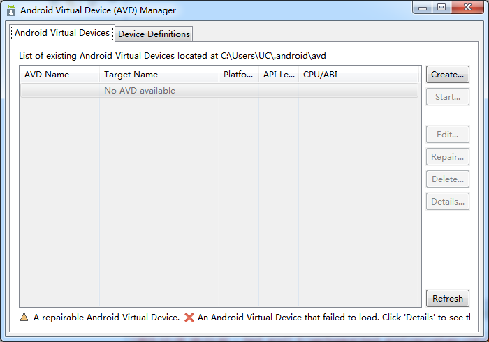

填写AVD Name（自己命名，主要是后面自己能够认出这个模拟的设备），选择Device设备类型，Target会自定帮你选择当前可用的最低版本，选择CPU/ABI、皮肤Skin，填写Internal Storage模拟的存储卡容量，OK。

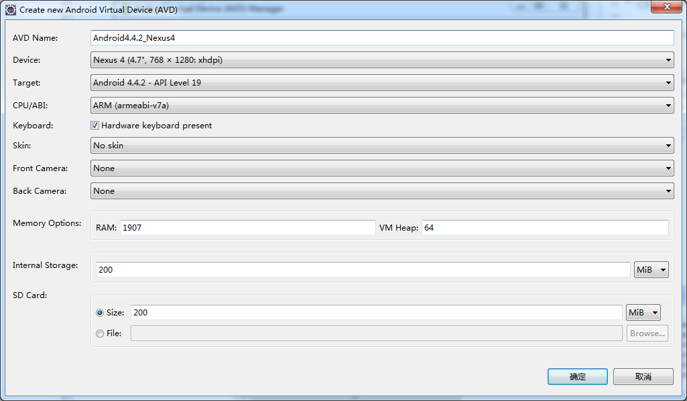

继续选中刚才创建的Android4.4.2_Nexus4->Start->Launch，即可开始模拟设备

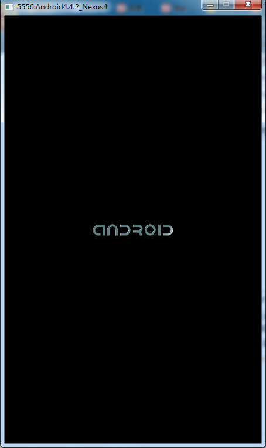

当然你也可以用Device Definitions直接Clone一个设置好的设备配置，把存储卡容量设置一下，然后再Create AVD。

## 创建Android项目
菜单栏，File->New->Project

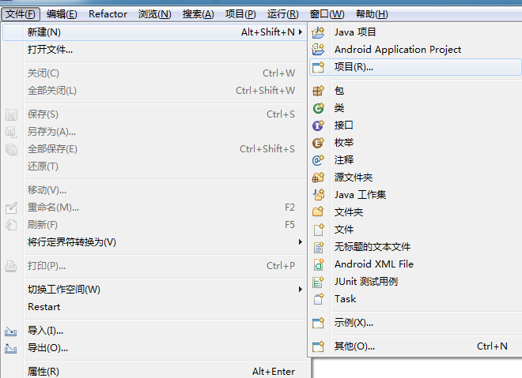

选中Android Application Project->Next

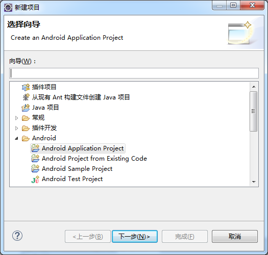

填写项目名称，只要填第一个框，下面是自动填上的

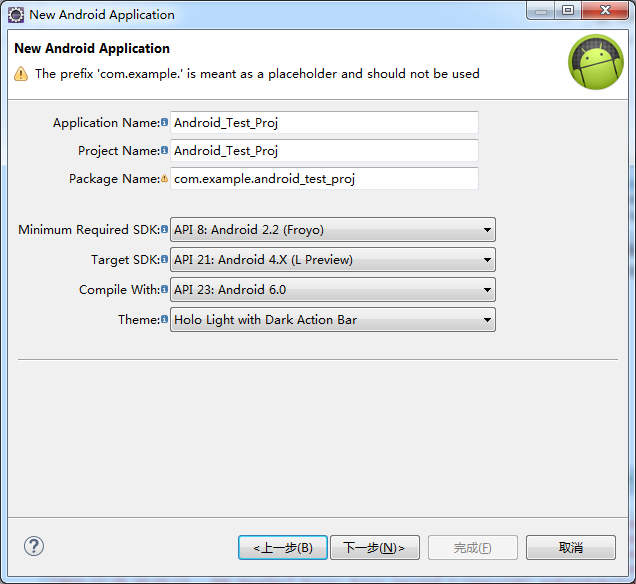

然后，一直Next，直到Finish，即可创建Android项目了

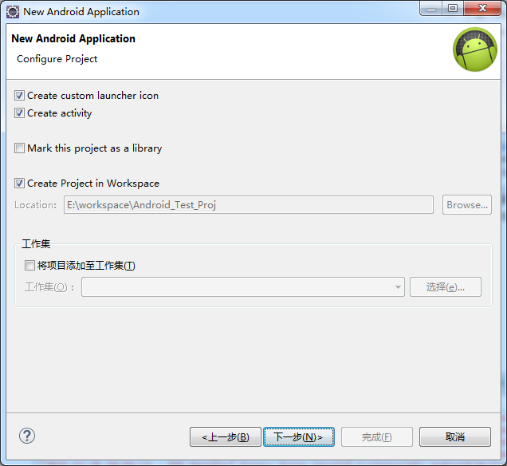

## 后言
因为我也是第一次搭建Android开发环境，跟着别人的教程走的，刚开始的时候是装在C盘下的，但是后来发现AndroidSDK下载tools后，太占用空间了，就不得不全部移到另一个空间充裕的盘下，eclipse也一起移了，顺便汉化了一下，可以看我的另一个帖子，[戳这里](2015-12-27-Eclipse-mars-中文语言安装.md)。

不得不提一下，这一套东西下载单机安装部分看起来小，线上安装后真是吓人。AndroidSDK因为之前用的解压版本，好像有点问题，我用安装程序在另一个盘下又安装了一次。

最后，能用[Android Studio](https://developer.android.com/studio/index.html)就用这个它吧，Eclipse装ADT弄不到官方的集成包，安装起来太看网速了，心累。如果能放心使用网上分享到是没话可说，但是提醒一下，前段时间苹果的编辑软件被注入不明代码的问题，不是官方的东西还是注意一点用吧。

## 参考链接
- [五步搞定Android开发环境部署——非常详细的Android开发环境搭建教程 - 边写边唱 - 博客园](http://www.cnblogs.com/zoupeiyang/p/4034517.html#5)
- [Win7下Android开发环境的搭建（更新于2015/3） - sensenxiangshang - 博客频道 - CSDN.NET](http://blog.csdn.net/mxsgoden/article/details/44342563)
- [AndroidDevTools](http://www.androiddevtools.cn/)
- [Android Studio](https://developer.android.com/studio/index.html)